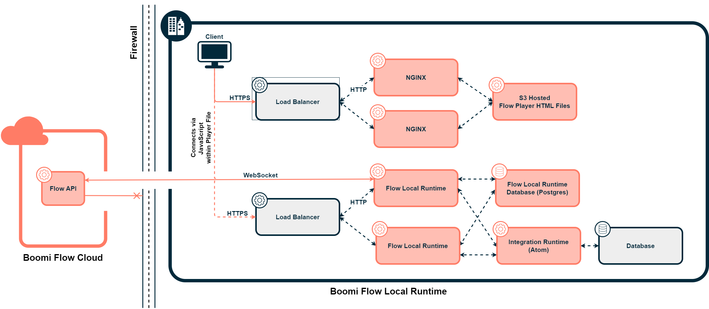
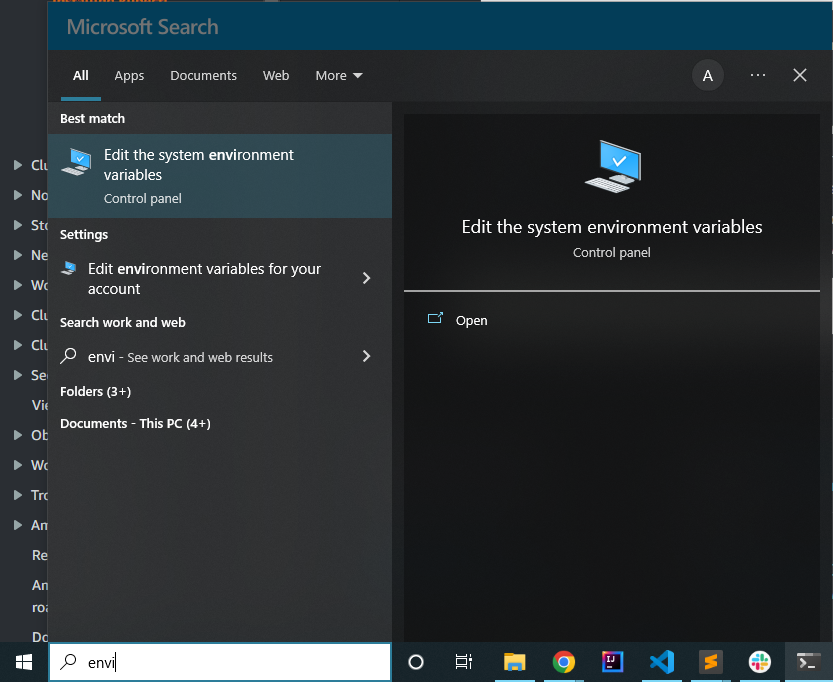

# Boomi Flow Multi-Cloud Runtime Kubernetes Implementation





[Boomi Flow Multi-Cloud Runtime (MCR)](https://help.boomi.com/bundle/flow/page/c-flo-MC.html) is a Boomi product that allows a customer to host their Flow runtime locally. The reason behind this is generally because of security concerns and will prevent data from traversing the public internet.

This reference implementation uses AWS's Elastic Kubernetes Server (EKS). The main configuration for other cloud providers would involve updating the Kubernetes Services that are used for the load balancers. The implementation uses NGINX (a reverse proxy) to proxy the Flow player file from S3 to the client's browser. Then JavaScript within the client's browser connects to the Boomi Flow Runtime. The Boomi Flow Runtime connects to a Postgres database to maintain statefulness. The Postgres database used within the implementation uses an Aurora Serverless v2 Postgres database, which is set to scale based on demand. The Boomi Flow Runtime can also interact with any Boomi Integration Runtime (i.e. atom, molecule, or cloud). The implementation references an atom, but an EKS Molecule repo can be [here](https://bitbucket.org/officialboomi/runtime-containers/src/master/eks/).

Below are the steps to get AWS CLI, eksctl, and kubectl locally set up, and the steps required to set up the boomi-flow-kubernetes implementation.


# Set up Local Environment Tools (Windows)

## Install AWS CLI

These installation instructions assume the computer being used is Windows.

First, install AWS CLI. AWS’s documentation can be found here: Installing or updating the latest version of the AWS CLI.

1. Download and run the AWS CLI MSI installer for Windows.https://awscli.amazonaws.com/AWSCLIV2.msi
2. To confirm the installation, open the Start menu, search for cmd to open a command prompt window, and at the command prompt use the `aws --version` command.

```
C:\> aws --version
aws-cli/2.4.5 Python/3.8.8 Windows/10 exe/AMD64 prompt/off
```

## Assume Role with AWS CLI

After AWS CLI is set up, config files will need to be set up if a user will need to assume roles. First, create the `.aws/credentials file`. This configuration is done by executing:

```
aws configure
```

Once it has been created, a config file will be populated within the .aws directory within your users root directory (e.g.C:\Users\AdamBedenbaugh\.aws\credentials).

Next, since Boomi uses Roles with our users, we will need to create another file within the directory that will be used with assume roles. AWS’s documentation: Using an IAM role in the AWS CLI

Create a file within the `.aws` directory called `config`. This is an example of what mine looks like for a development account:

```
[default]
region = us-east-1
output = json

[profile boomi-pso-tech-sandbox]
region = us-east-1
role_arn = arn:aws:iam::<aws-account-id>:role/admin
source_profile = <user-name>
mfa_serial = arn:aws:iam::<aws-account-id>:mfa/<user-name>
```

The `role_arn` can be found under the IAM dashboard after you have assumed a role.

The `source_profile` can be found by going into IAM. It will be the last part of the User ARN.

The `mfa_serial` can be found by going to your user IAM when you are not signed into a role. Then going to the Security credentials tab. Your MFA device’s arn can be found under Assigned MFA device.

Once all of that information is set up, then you will be able to access AWS resources with the privileges of the assigned role. The following command will set your default EKS instance when your run `kubeclt` and will set your role. Once the command is executed, it will ask for an MFA token.

```
# Generic
aws eks --region <region-of-eks-cluster> update-kubeconfig --name <eks-cluster-name> --profile <profile-name-within-.aws/config>

# Variables populated
aws eks --region us-east-1 update-kubeconfig --name ab-eks-molecule --profile boomi-pso-tech-sandbox
```


## Install eksctl

THIS SECTION IS FOR THE FUTURE STATE OF THE PROJECT. THERE WILL EVENTUALLY BE A YAML FILE TO CONFIGURE AN EKS CLUSTER.

[`eksctl`](https://eksctl.io/) is a simple CLI tool for creating and managing clusters on EKS - Amazon's managed Kubernetes service for EC2. eksctl will be used to setup EKS within AWS. If you are manually creating the resources then this can be skipped.


### Install Chocolatey

[Chocolatey](https://chocolatey.org/) is a Windows package manager and will be used to install eksctl. The instructions will use PowerShell with Administrative privileges. Chocolatey’s documentation can be found here: [Chocolatey Setup/Install](https://docs.chocolatey.org/en-us/choco/setup).

1. Open up PowerShell with Administrative privileges. This task can be done by searching for PowerShell and right-clicking the icon.
2. Run `Get-ExecutionPolicy`. If it returns Restricted, then run `Set-ExecutionPolicy AllSigned`.
3. Run the following command.

```
Set-ExecutionPolicy Bypass -Scope Process -Force; [System.Net.ServicePointManager]::SecurityProtocol = [System.Net.ServicePointManager]::SecurityProtocol -bor 3072; iex ((New-Object System.Net.WebClient).DownloadString('https://community.chocolatey.org/install.ps1'))
```

4. Run `choco -version` to confirm the installation was successful.


### Install eksctl

Next, use [AWS’s documentation on installing eksctl with Chocolatey](https://docs.aws.amazon.com/eks/latest/userguide/eksctl.html).

1. Install eksctl by opening PowerShell and executing the following command.

```
choco install -y eksctl 
```

2. Test that your installation was successful with the following command.
```
eksctl version
```

## Install kubectl

Finally, install kubectl, which is used to interact with the Kubernetes API on the Kubernetes cluster.

1. Open a PowerShell terminal.
2. Download the `kubectl` binary for your cluster’s Kubernetes version from Amazon S3. I’m using the most recent version at the time (1.22), but please check [AWS’s documentation to obtain a version that matches your cluster’s version](https://docs.aws.amazon.com/eks/latest/userguide/install-kubectl.html).

```
curl -o kubectl.exe https://s3.us-west-2.amazonaws.com/amazon-eks/1.22.6/2022-03-09/bin/windows/amd64/kubectl.exe
```

3. Move the `kubectl.exe` file to a directory to store the command line binaries. I use C:\SDKs to store these types of files but anywhere would work.
4. Add the full directory path to your system PATH environment variables.
5. Search for Environment variables and select.



6. Then click on Environment Variables within the System Properties panel.


7. Find Path under System variables and click Edit.


8. Add the location of the kubelet.exe file that was saved to the Path variable.


9. Log out and back in.

10. Open a PowerShell terminal and confirm that the installation was successful.

```
kubectl version --short --client
```


# Setting up Kubernetes within AWS


## EKS Cluster

TODO: ADD TEMPLATE TO EKS CLUSTER CREATION


## Boomi Flow MCR Deployment

Once your local environment is set up, you can then execute the following commands to deploy the EKS implementation. All environment variables are saved within the ConfigMap and Secret yaml files. 

The configuration will occur in the following order:
```
kubectl apply -f boomi-flow-namespace.yaml
kubectl apply -f boomi-flow-configmap.yaml
kubectl apply -f boomi-flow-secret.yaml
kubectl apply -f boomi-flow-nginx-service.yaml
kubectl apply -f boomi-flow-nginx-deployment.yaml
kubectl apply -f boomi-flow-runtime-service.yaml
kubectl apply -f boomi-flow-runtime-deployment.yaml
```


## Installing Metrics Server

TODO: ADD TEMPLATE FOR HPA.


# Troubleshooting

First, see if any errors are occurring before the containers even start.

```
# Get the running state of the pod
kubectl get pods -n <namespace>
# Get details on specific pod
kubectl describe <pod-name> -n <namespace>
```

If `kubectl describe` gives details about the services, then run `kubectl get <service> -n <namespace>` to see their status. Then run `kubectl describe <service> <pod-name> -n <namespace>` to get more detail on the issue.  

Next, review the logs to see if there were any errors on starting the container. The command is based on there being a single container within the pod. Use -c if you have multiple.

```
kubectl logs <pod-name> -n <namespace>
```


### Boomi Documentation:
* [Setting up a Local Flow MCR Runtime](https://help.boomi.com/bundle/flow/page/c-flo-MC_Creating_Local_Runtime.html)
* [Local Runtime HTML5 player setup](https://help.boomi.com/bundle/flow/page/c-flo-MC_Players.html)
* [Flow Runtime Health Check](https://help.boomi.com/bundle/flow/page/c-flo-MC_Health.html)

### References:
* [Reference used for nginx.conf file used with S3](https://www.scaleway.com/en/docs/tutorials/setup-nginx-reverse-proxy-s3/)